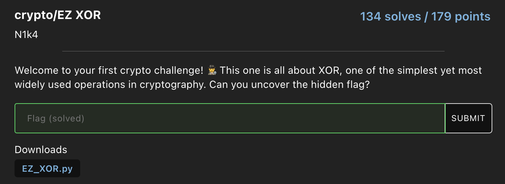

# EZ XOR
## Challenge 



We are given this python script:
```py linenums="1" title="EZ_XOR.py"
from pwn import *
FLAG = os.environ.get("FLAG", "FMCTF{F4K3_FL49}").encode()
key = os.urandom(7)
encryptedFlag = xor(FLAG, key).hex()
print(f"encryptedFlag = {encryptedFlag}")
# encryptedFlag = a850d725cb56b0de4fcb40de72a4df56a72ec06cafa75ecb41f51c95
```

## Solve
Knowing the flag format, we xor the known characters to get the key, and xor the key with the ciphered text to get the flag
```py linenums="1"
from pwn import *
s = bytes.fromhex("a850d725cb56b0de4fcb40de72a4df56a72ec06cafa75ecb41f51c95")
key = xor(b'FMCTF{', s[:6]) + xor(b'}', s[-1])
print(xor(s, key))
```

??? success "Flag"
    FMCTF{X0R_1S_L1K3_MAGIC_0x1}