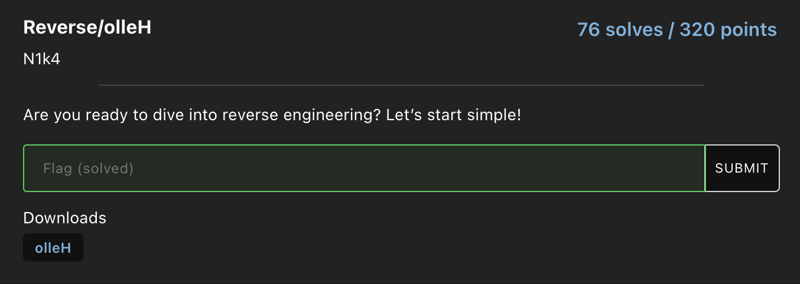

# olleH
## Challenge 

We're given a binary file called [olleH](olleH). 
## Solve
I used Ghidra to decompile the binary, here's the main part:
```c linenums="1"
undefined8 main(void){
  bool bVar1;
  size_t sVar2;
  size_t sVar3;
  long in_FS_OFFSET;
  int local_b8;
  int local_b0;
  byte local_9f [39];
  byte local_78 [104];
  long local_10;

  local_10 = *(long *)(in_FS_OFFSET + 0x28);
  local_9f[0] = 0x4e;
  local_9f[1] = 0x6f;
  local_9f[2] = 0x77;
  local_9f[3] = 0x72;
  local_9f[4] = 0x75;
  local_9f[5] = 0x7a;
  local_9f[6] = 0;
  local_9f[7] = 8;
  local_9f[8] = 0x22;
  local_9f[9] = 0x34;
  local_9f[10] = 0x26;
  local_9f[0xb] = 0x33;
  local_9f[0xc] = 1;
  local_9f[0xd] = 6;
  local_9f[0xe] = 0x5c;
  local_9f[0xf] = 0x1b;
  local_9f[0x10] = 0x1e;
  local_9f[0x11] = 0x45;
  local_9f[0x12] = 0x25;
  local_9f[0x13] = 0x3c;
  local_9f[0x14] = 0x5c;
  local_9f[0x15] = 1;
  local_9f[0x16] = 0x41;
  local_9f[0x17] = 7;
  local_9f[0x18] = 9;
  local_9f[0x19] = 0x7d;
  local_9f[0x1a] = 0x30;
  local_9f[0x1b] = 0x44;
  local_9f[0x1c] = 0x1c;
  local_9f[0x1d] = 0x12;
  local_9f[0x1e] = 0x25;
  local_9f[0x1f] = 0x7e;
  local_9f[0x20] = 0x17;
  local_9f[0x21] = 0x42;
  local_9f[0x22] = 0x45;
  local_9f[0x23] = 0x16;
  local_9f[0x24] = 7;
  sVar2 = strlen((char *)local_9f);
  printf("Enter your flag: ");
  __isoc99_scanf(&DAT_0010201a,local_78);
  sVar3 = strlen((char *)local_78);
  if ((int)sVar3 == 0x1e) {
    for (local_b8 = 0; local_b8 < 0x1e; local_b8 = local_b8 + 1) {
      local_78[local_b8] = local_78[local_b8] ^ local_9f[local_b8 % (int)sVar2];
    }
    bVar1 = true;
    for (local_b0 = 0; local_b0 < 0x1e; local_b0 = local_b0 + 1) {
      if (local_78[local_b0] != local_9f[(long)local_b0 + 7]) {
        bVar1 = false;
        break;
      }
    }
    if (bVar1) {
      puts("Victory! You found the correct flag!");
    }
    else {
      puts("Try again!");
    }
  }
  else {
    printf("Try again! (Flag length should be %d characters)\n",0x1e);
  }
  if (local_10 == *(long *)(in_FS_OFFSET + 0x28)) {
    return 0;
  }
                    // WARNING: Subroutine does not return
  __stack_chk_fail();
}
```
Using the c program below I was able to figure out the value of local_9f variable, which is "nowruz", and by reversing the proccess done in the original code, I got the flag:
```c linenums="1"
#include <iostream>
using namespace std;

int main(){
    int local_9f[39];
    local_9f[0] = 0x4e;
    local_9f[1] = 0x6f;
    local_9f[2] = 0x77;
    local_9f[3] = 0x72;
    local_9f[4] = 0x75;
    local_9f[5] = 0x7a;
    local_9f[6] = 0;
    local_9f[7] = 8;
    local_9f[8] = 0x22;
    local_9f[9] = 0x34;
    local_9f[10] = 0x26;
    local_9f[0xb] = 0x33;
    local_9f[0xc] = 1;
    local_9f[0xd] = 6;
    local_9f[0xe] = 0x5c;
    local_9f[0xf] = 0x1b;
    local_9f[0x10] = 0x1e;
    local_9f[0x11] = 0x45;
    local_9f[0x12] = 0x25;
    local_9f[0x13] = 0x3c;
    local_9f[0x14] = 0x5c;
    local_9f[0x15] = 1;
    local_9f[0x16] = 0x41;
    local_9f[0x17] = 7;
    local_9f[0x18] = 9;
    local_9f[0x19] = 0x7d;
    local_9f[0x1a] = 0x30;
    local_9f[0x1b] = 0x44;
    local_9f[0x1c] = 0x1c;
    local_9f[0x1d] = 0x12;
    local_9f[0x1e] = 0x25;
    local_9f[0x1f] = 0x7e;
    local_9f[0x20] = 0x17;
    local_9f[0x21] = 0x42;
    local_9f[0x22] = 0x45;
    local_9f[0x23] = 0x16;
    local_9f[0x24] = 7;

    char guess[31]; guess[30] = '\0';
    for(int i = 0; i < 30; i++)
        guess[i] = local_9f[i + 7];
    
    for(int i = 0; i < 30; i++)
        guess[i] = guess[i] ^ local_9f[i % 6];
    
    cout << guess;
}
```


??? success "Flag"
    FMCTF{H3ll0_r3v3rs3_3ng_0x57c}
